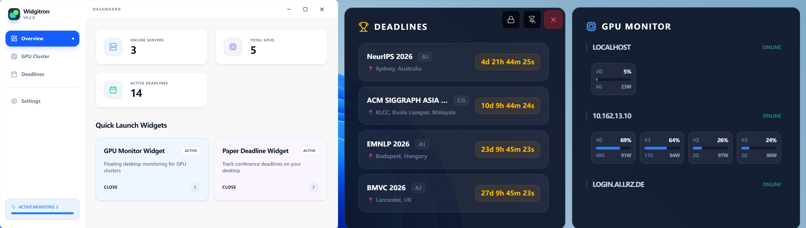

# Widgitron


**A high-performance, modular desktop widget framework for researchers and developers.**

> [!TIP]
> Windows users can download the pre-compiled standalone executable directly from the [Releases](https://github.com/caizhuojiang/widgitron/releases) page.

Widgitron is a modern, cross-platform dashboard built with **Tauri**, **Rust**, and **React**. It provides a premium, glassmorphic UI for monitoring GPUs, conference deadlines, and more, with a focus on efficiency and HPC cluster compatibility.



## 🗺️ Roadmap

### ✅ Completed
- [x] Tauri 2.0 & Rust backend migration
- [x] Modern React-based Glassmorphism UI
- [x] GPU monitoring (Persistent SSH)
- [x] Slurm integration & Job ID tracking
- [x] Paper deadline countdown widget

### 🚧 Planned
- [ ] Direct server file management widget
- [ ] Integrated LLM assistant widget
- [ ] Plugin system for community widgets
- [ ] Advanced widget theme customization
- [ ] Enhanced multi-monitor layout support


## 🚀 Quick Start

### Installation

```bash
# Clone the repository
git clone https://github.com/caizhuojiang/widgitron.git
cd widgitron

# Install dependencies
pnpm install
```

### Configuration

**Configure GPU Monitor** (`configs/gpu_monitor.json`):
```json
{
    "servers": [
        {
            "host": "your-server.com",
            "user": "username",
            "key_file": "~/.ssh/id_rsa",
            "port": 22
        }
    ]
}
```

See `configs/gpu_monitor.json` for more details.

### Run

```bash
# Development mode
pnpm tauri dev

# Build production executable
pnpm tauri build
```

## 📊 Built-in Widgets

### GPU Monitor

Intelligent remote GPU monitoring optimized for HPC environments:
- 📡 **HPC Compliant**: Uses persistent SSH to minimize load on login nodes.
- 🚀 **Slurm Support**: Real-time job tracking and Job ID management.
- 🔔 **Smart Alerts**: Idle notifications and custom usage thresholds.
- 🌐 **Flexible Connectivity**: Proxy and jump host support.

### Paper Deadline Monitor

Keep track of conference deadlines with high-precision countdowns:
- ⏳ **Real-time Countdowns**: Precise tracking down to the second.
- 🎯 **Smart Filtering**: Filter by conference types or research areas.
- 🔁 **Auto-Sync**: Automatically updates and sorts by proximity.

## 🤝 Contributing

Contributions welcome! Here's how:

1. Fork the repository
2. Create a feature branch (`git checkout -b feature/amazing-widget`)
3. Commit your changes (`git commit -m 'Add amazing widget'`)
4. Push to the branch (`git push origin feature/amazing-widget`)
5. Open a Pull Request

## 📄 License

MIT License - see [LICENSE](LICENSE) file for details.
